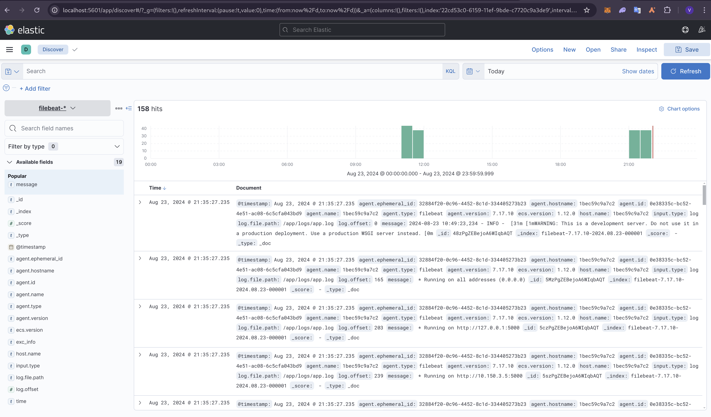
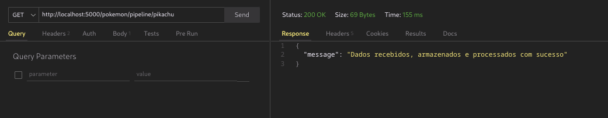
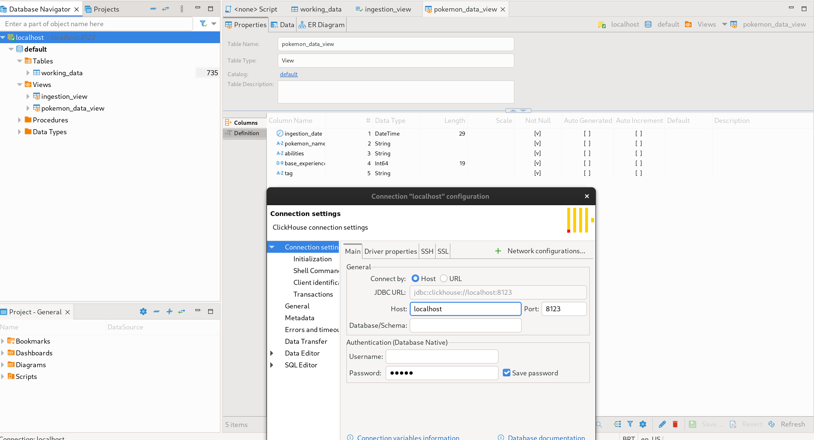
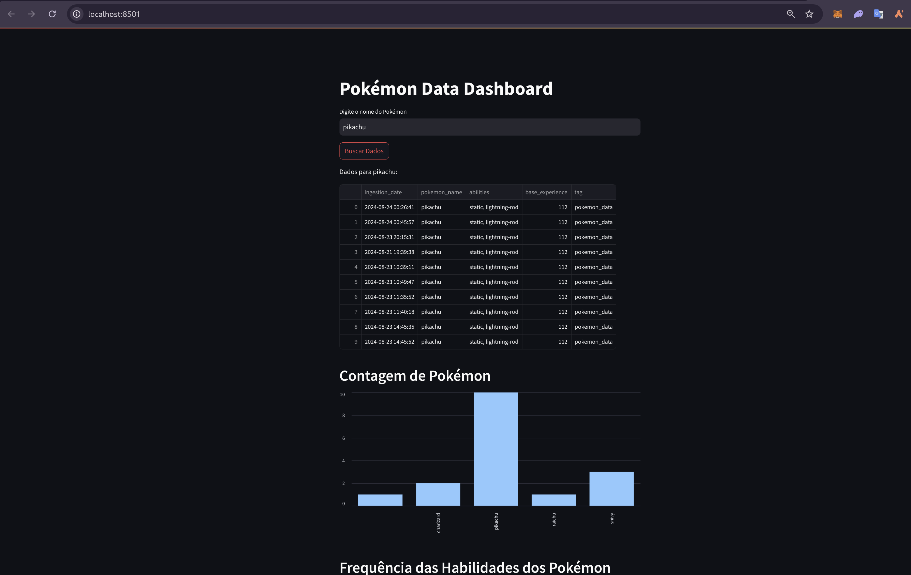

# How to run the project
> [!IMPORTANT]
> You need to have Docker installed to run the project 

```shell
git clone https://github.com/vict0rcarvalh0/data-lake-ingestion.git

cd data-lake-ingestion/data_pipeline

docker compose up --build
```

- Open <a href="http://localhost:9000/">http://localhost:9000/</a> to access MinIO to check bucket storage.
- Open <a href="http://localhost:8123/">http://localhost:8123/</a> to check Clickhouse health.
- Open <a href="http://localhost:5601/">http://localhost:5601/</a> to access ElasticSearch and Kibana to check logging.

<p align="center">
  
</p>

After that, test the data pipeline by executing the GET endpoint http://localhost:5000/pokemon/pipeline/<pokemon_name> on Postman.
<p align="center">
  
</p>

If you want to connect Clickhouse on your Database Tool(e.g: DBeaver), follow the example:
<p align="center">
  
</p>

# How to run the tests

> [!IMPORTANT]
> You need to have Python 3.12.4 and Poetry installed to run the tests project

```shell
cd data-lake-ingestion/data_pipeline

poetry run pytest
```
<p align="center">
  
</p>

## [Optional]

> [!IMPORTANT]
> You need to have Python 3.12.4 and Poetry installed to run the Streamlit project

You can also run Streamlit App in another terminal to check it out the Pokemón Dashboard!

```shell
cd data-lake-ingestion/data_pipeline/streamlit_app

poetry install --no-cache

poetry run streamlit run ./app.py
```

<p align="center">
  
</p>
